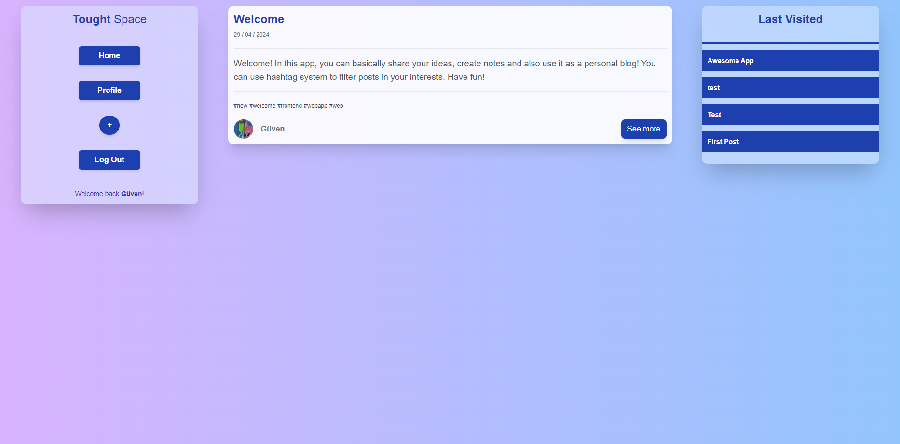
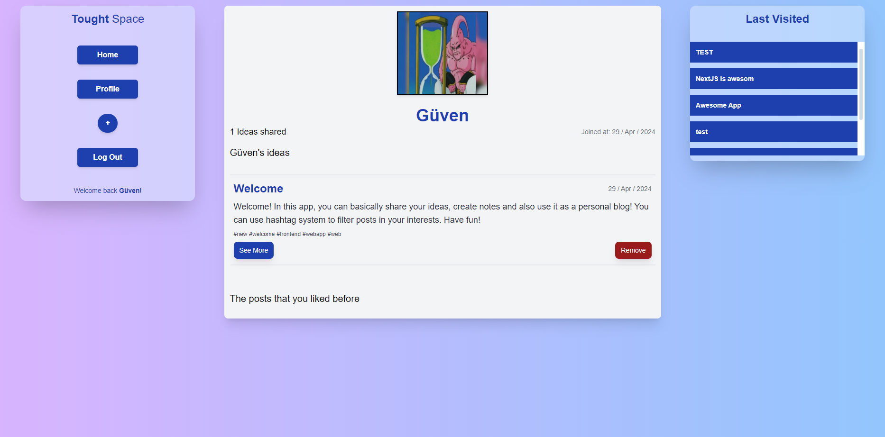
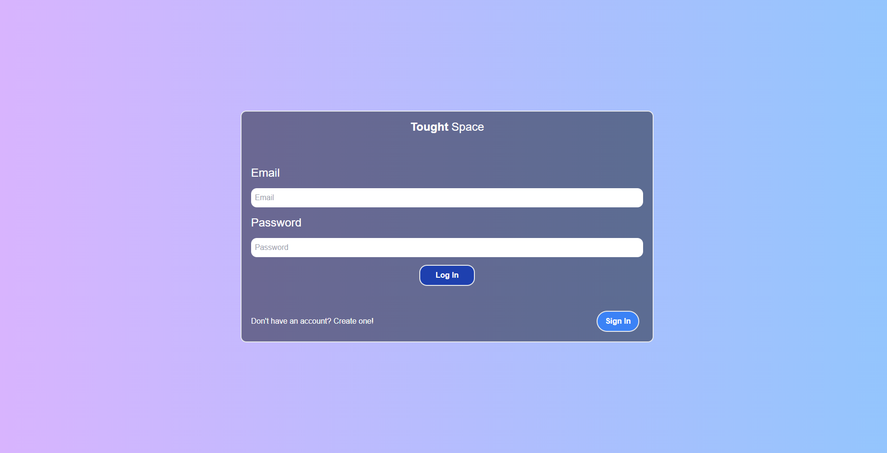
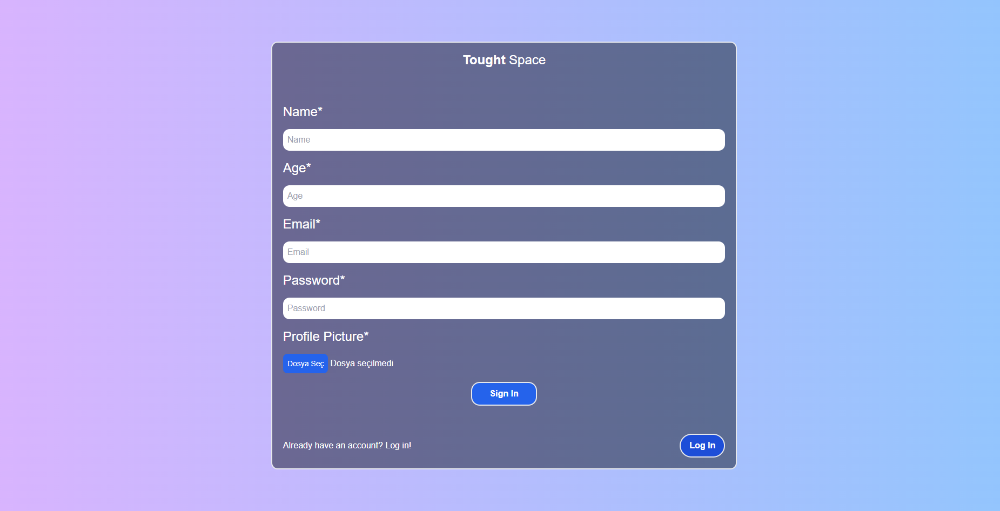
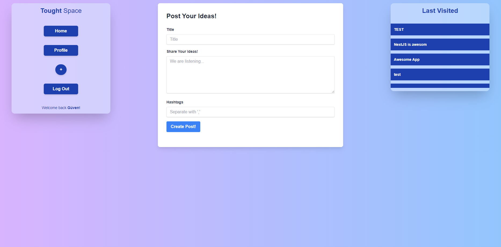

# Tought Space
## [Live Site](https://tought-space.vercel.app)

Tought Space is a cutting-edge social media application designed for users to unleash their creativity, share thoughts, and engage with a community of like-minded individuals. Powered by Firebase, NextJS, and Tailwind CSS, this platform offers a seamless and stylish user experience for blogging and social interactions.

## Features 
### - Create & Edit Posts: Effortlessly post your ideas, edit them as needed, and express your thoughts with customizable hashtags to increase their visibility.
### - Interactive Post Engagement: Like posts to show your appreciation, and see how many people are interested in similar topics through the click rate feature.
### - Personalized Profiles: Set up your profile with a custom profile picture, making your interactions more personal and engaging.
### - Hashtag Functionality: Use hashtags to categorize your posts or find related content created by others.
### - Last Visited Posts: Quickly access posts you've recently viewed, so you never lose track of interesting ideas or discussions.
### - Analytics: Gain insights into how your posts perform with our built-in click rate analysis, helping you understand what resonates best with your audience.
Tought Space serves as an ideal platform for anyone looking to establish a personal blog, share unique ideas, or simply explore new perspectives. Whether you're looking to share detailed articles, quick thoughts, or innovative ideas, Tought Space is the place to be!

## Get Started: 
To get started with Tought Space, follow these simple steps:

- Sign up to create your account.
- Customize your profile.
- Start creating and sharing your posts!
- Engage with other users and grow your network.

 
App preview
  
<h3>HomePage</h3>

<h3>Profile</h3>

<h3>LogIn SignIn Page</h3>

<h3>Post Creation Page</h3>

  

- Clean Code Practices: Adhere to the principles of writing clean, understandable, and maintainable code to enhance both development and maintenance.
- Micro File Organization: Maintain a well-organized file and folder structure to ensure ease of navigation and scalability of the application.
- NextJS and App Page Routing: Utilize NextJS for server-side rendering and its powerful routing capabilities to create a seamless user experience.
- Firebase Database Integration: Implement Firebase as a real-time database solution to store and retrieve user data efficiently.
- User Authentication System: Securely manage user sessions and authentication with Firebase’s robust built-in capabilities.
- User Profile Photo Upload and Management: Allow users to upload and manage their profile photos, enhancing personalization and user identity.
- Post Creation and Deletion: Enable users to easily create and delete posts, providing a dynamic platform for content management.
